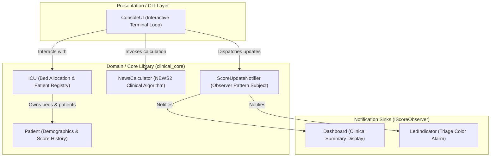

# ClinicalMonitoringCpp

[](https://github.com/led-21/ClinicalMonitoringCpp/actions/workflows/build.yml)


A modern C++20 simulation of an intensive care unit (ICU) clinical monitoring system, implementing standardized early warning score calculations, event-driven observer alerts, and patient lifecycle management.

---

## Overview

In critical care environments such as Intensive Care Units (ICUs), timely detection of clinical deterioration is vital for patient survival. Clinical protocols such as the **National Early Warning Score (NEWS2)**, standardized by the Royal College of Physicians, provide a systematic approach to aggregating physiological vital signs into a single predictive risk score.

This project models the core domain of an ICU patient monitoring service. It manages bed allocation, tracks patient vitals over time, computes the NEWS score according to strict clinical thresholds, and broadcasts real-time alert updates to connected sinks (such as dashboards and visual alert indicators) using an event-driven observer architecture.

Designed as an engineering showcase, the codebase demonstrates clean modern C++20 idioms, robust encapsulation, value semantics, RAII, decoupled interfaces, and automated test coverage without third-party runtime dependencies.

---

## Architecture

The system is organized into modular layers with clear separation of concerns:



### Component Roles

* **`clinical::NewsCalculator`**: Stateless, pure calculation engine that validates physiological inputs and maps vital signs to standardized component scores and composite risk levels (`Low`, `Low-Medium`, `Medium`, `High`).
* **`clinical::Patient`**: Encapsulates patient identification and chronological assessment history.
* **`clinical::ICU`**: Manages fixed bed capacity (1 to 6 beds), enforces occupancy invariants, and handles admission, lookup, and discharge lifecycles.
* **`clinical::ScoreUpdateNotifier`**: Implements the Observer pattern, aggregating patient status across occupied beds and notifying registered observers without tight coupling.
* **`clinical::Dashboard` & `clinical::LedIndicator`**: Concrete implementations of `IScoreObserver` providing formatted console dashboards and triage status indicators with stream injection support.

---

## Engineering Highlights

* **Modern C++20 & Constexpr Computing**: Built using `-std=c++20`, featuring compile-time `constexpr` physiological calculation, `static_assert` verification, `std::string_view`, and structured binding support.
* **Strong Typing & Zero-Heap Calculation**: Uses strongly-typed domain enums (`RiskLevel`, `AlertColor`, `ConsciousnessLevel`) and fixed `std::array<int, 7>` component scores, eliminating dynamic memory allocations in calculation hot-paths.
* **RAII Scoped Subscriptions**: `ScoreUpdateNotifier` provides `ScopedSubscription` handles with move semantics that automatically disconnect upon scope exit, preventing dangling pointer references.
* **Exception Safety & Fault Isolation**: Observer dispatch executes in an isolated environment; an unhandled exception in one downstream monitor will never interrupt or truncate alert delivery to subsequent healthy observers.
* **Stream Dependency Inversion**: `Dashboard` and `LedIndicator` accept configurable `std::ostream&` references (defaulting to `std::cout`), enabling deterministic, hermetic unit testing without global state manipulation.
* **49 Automated Unit Tests**: Comprehensive test suite covering clinical boundary conditions, capacity limits, unsubscription lifecycle, exception resilience, and CTest integration.
* **Zero External Dependencies**: Pure standard C++ (STL) implementation with native CMake configuration, building seamlessly across compilers (MSVC, GCC, Clang).

---

## Technologies

* **Language**: C++20
* **Build System**: CMake 3.20+
* **Standard Library**: ISO C++ Standard Library (STL)
* **Test Runner**: Native C++ test framework integrated with **CTest**
* **Continuous Integration**: GitHub Actions (Windows MSVC + Ubuntu GCC)

---

## Project Structure

```text
ClinicalMonitoringCpp/
├── .github/
│   └── workflows/
│       └── build.yml               # Multi-platform CI workflow
├── include/
│   └── clinical/                   # Public domain headers
│       ├── Models.h                # Data structs (vitals, scores, updates)
│       ├── Patient.h               # Patient domain entity
│       ├── NewsCalculator.h        # NEWS2 scoring engine
│       ├── ICU.h                   # ICU ward and bed management
│       ├── ScoreObserver.h         # IScoreObserver interface
│       ├── ScoreUpdateNotifier.h   # Notification broadcaster
│       ├── Dashboard.h             # Clinical dashboard observer
│       └── LedIndicator.h          # Visual triage indicator
├── src/                            # Implementation files
│       ├── NewsCalculator.cpp
│       ├── ICU.cpp
│       ├── ScoreUpdateNotifier.cpp
│       ├── Dashboard.cpp
│       └── LedIndicator.cpp
├── app/                            # Console application
│       ├── ConsoleUI.h
│       ├── ConsoleUI.cpp
│       └── main.cpp
├── tests/                          # Automated test suite
│       ├── TestFramework.h         # Assertion and test case primitives
│       ├── NewsCalculatorTests.h
│       ├── NewsCalculatorTests.cpp # 18 tests for NEWS calculation
│       ├── IcuBedManagementTests.h
│       ├── IcuBedManagementTests.cpp # 16 tests for bed lifecycle
│       ├── ObserverNotificationTests.h
│       ├── ObserverNotificationTests.cpp # 10 tests for observers
│       └── main.cpp                # Test runner executable
├── CMakeLists.txt                  # Modular CMake configuration
├── .gitignore                      # Git ignore rules for CMake & C++
├── LICENSE                         # MIT License
└── README.md
```

---

## Building

### Prerequisites

* C++20 compliant compiler:
  * MSVC 19.29+ (Visual Studio 2019 / 2022 / 2026)
  * GCC 11+
  * Clang 13+
* CMake 3.20 or newer

### Build Instructions

```bash
# 1. Configure the build
cmake -S . -B build -DCMAKE_BUILD_TYPE=Release

# 2. Compile all targets (library, application, tests)
cmake --build build --config Release
```

---

## Running

Launch the interactive console application:

### Windows
```powershell
.\build\Release\icu_monitor_app.exe
```

### Linux / macOS
```bash
./build/icu_monitor_app
```

### Menu Options

* `n` - Calculate new NEWS score for a bed (admitting a new patient if vacant).
* `h` - Print chronological score history for a patient ID.
* `a` - Print latest scores and risk levels across all admitted patients.
* `d` - Discharge a patient and release their bed for subsequent admissions.
* `x` - Exit application.

---

## Testing

Run the automated test suite through CTest:

```bash
ctest --test-dir build -C Release --output-on-failure
```

Or execute the unit test binary directly:

```bash
# Windows
.\build\Release\unit_tests.exe

# Linux / macOS
./build/unit_tests
```

### Test Coverage Highlights

* **NEWS Validation & Thresholds (18 tests)**: Boundary scoring for respiration rate, oxygen saturation, temperature, blood pressure, heart rate, supplemental oxygen, and consciousness levels ('A', 'V', 'P', 'U').
* **ICU Bed Management (16 tests)**: Bed indexing (1–6), re-admission protection, full capacity handling, query by ID, and bed recycling after discharge.
* **Observer & Alert Broadcasting (13 tests + compile-time checks)**: Observer dispatch, subscriber fanout, empty observer safety, stream redirection, RAII ScopedSubscription auto-disconnection, move semantics, and exception fault isolation.

---

## Design Decisions

1. **Stateless Scoring vs. Stateful Patient**:
   `NewsCalculator` does not maintain internal state or hold patient references. It operates strictly on immutable `PhysiologicalParameters` and returns `std::optional<NewsScore>`, making calculation thread-safe and isolated from storage.

2. **Explicit Nullability via `std::optional`**:
   Rather than throwing exceptions on physiologically invalid input (such as out-of-range oxygen saturation or negative heart rates), the calculation returns `std::nullopt`. This treats validation errors as expected domain states rather than exceptional runtime failures.

3. **Observer Pattern with Stream Redirection & RAII**:
   Display observers (`Dashboard`, `LedIndicator`) accept an output stream reference in their constructor, keeping presentation testable. Subscriptions can be managed via move-only `ScopedSubscription` handles for automatic lifetime management and zero dangling pointers.

4. **Ownership and Resource Lifetime**:
   The ICU ward holds exclusive ownership of admitted patients using `std::unique_ptr<Patient>`. Discharging a patient explicitly resets the smart pointer, enforcing immediate deallocation and preventing stale memory retention.

---

## Possible Improvements

* **Concurrency & Thread Safety**: Introduce read-write locking (`std::shared_mutex`) around `ICU` bed access and thread-safe queues in `ScoreUpdateNotifier` to support concurrent telemetry ingestion.
* **Persistent Storage**: Abstract a repository interface (`IPatientRepository`) to persist patient histories across sessions (e.g., SQLite or JSON file storage).
* **REST / gRPC Service**: Expose the core monitoring engine as a microservice receiving telemetry from simulated bedside monitors.

---

## Background

This project originated from a technical software engineering exercise and was subsequently redesigned, modularized, and expanded into an independent C++ engineering portfolio project.

---

## License

This project is licensed under the MIT License - see the [LICENSE](LICENSE) file for details.
